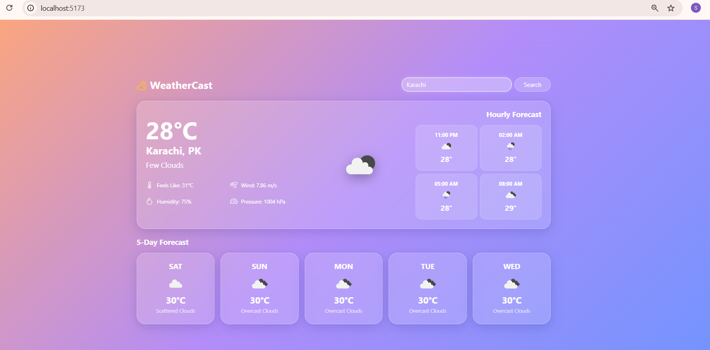

# 🌤 WeatherCast - Real-Time Weather Dashboard

## 📖 Description

WeatherCast is a modern and responsive weather application built using **React.js** and **Vite**. It provides real-time weather information by integrating the **OpenWeather API**. Users can search for any city or use their current location to view accurate weather details, including temperature, humidity, wind speed, pressure, visibility, sunrise, sunset, hourly forecast, and a 5-day forecast.

---

## ✨ Features

- 🔍 Search weather by city name
- 📍 Get weather using current location
- 🌡 Real-time temperature updates
- 🌤 Weather condition with dynamic icons
- 💧 Humidity information
- 🌬 Wind speed
- 📈 Atmospheric pressure
- 👀 Visibility details
- 🌅 Sunrise & 🌇 Sunset timing
- ⏰ Hourly weather forecast
- 📅 5-Day weather forecast
- 🎨 Dynamic background based on weather
- 📱 Fully responsive UI
- ⚠️ Error handling for invalid city names

---

## 🛠 Technologies Used

- React.js
- Vite
- JavaScript (ES6)
- HTML5
- CSS3
- Axios
- Bootstrap
- OpenWeather API

---

## 📂 Project Structure

```text
WeatherCast/
│
├── public/
├── screenshot/
│   └── Home.png
├── src/
│   ├── App.jsx
│   ├── App.css
│   ├── main.jsx
│   └── index.css
│
├── .env.example
├── .gitignore
├── package.json
├── README.md
```
## ⚙ Installation

### Clone the repository

```bash
git clone https://github.com/samarrrashidd-ship-it/WeatherCast.git
```

### Move into the project folder

```bash
cd WeatherCast
```

### Install dependencies

```bash
npm install
```

### Create a `.env` file

Create a file named:

```text
.env
```

Add your OpenWeather API Key:

```env
VITE_WEATHER_API_KEY=YOUR_API_KEY_HERE
```

You can get your free API key from:

https://openweathermap.org/api

### Start the development server

```bash
npm run dev
```

The application will run on:

```text
http://localhost:5173
```

(or another available port if 5173 is already in use.)

---

## 📸 Screenshots

### 🏠 Home Page



## 🔐 Environment Variables

This project uses an environment file to keep API keys secure.

Example:

```env
VITE_WEATHER_API_KEY=YOUR_API_KEY_HERE
```

---

## 🚀 Future Improvements

- 🌍 7-Day Weather Forecast
- 🌙 Dark / Light Mode
- ⭐ Favorite Cities
- 📊 Weather Charts
- 🌐 Multi-language Support

---

## 👩‍💻 Author

**Samar Rashid**

GitHub: https://github.com/samarrrashidd-ship-it

---

## 📄 License

This project is created for learning and portfolio purposes.